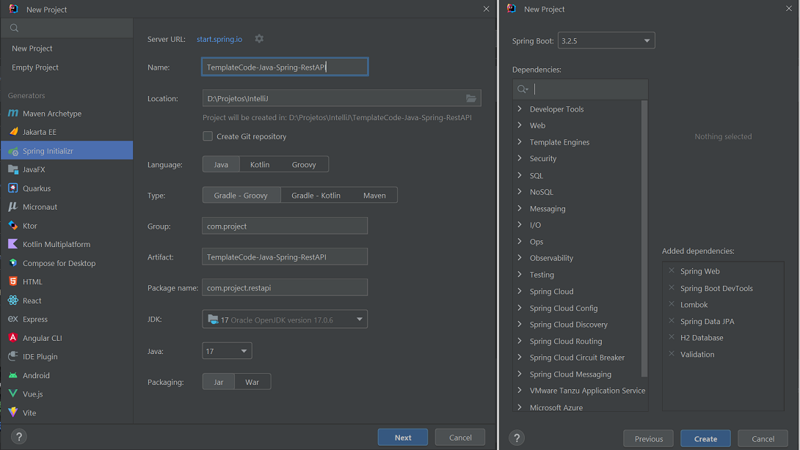
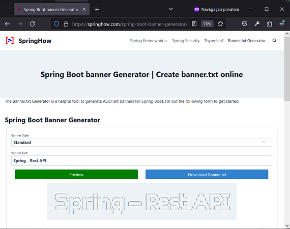
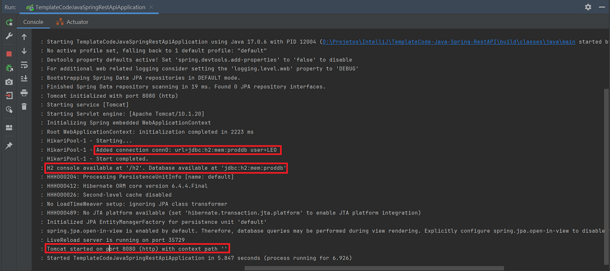
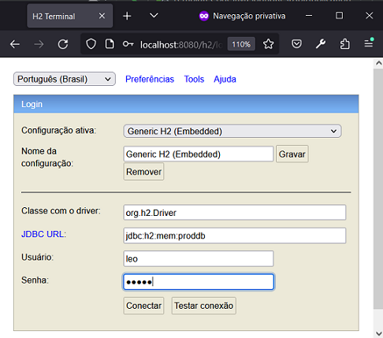
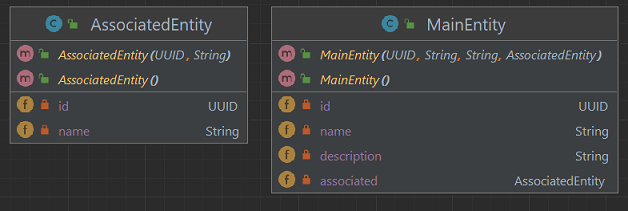
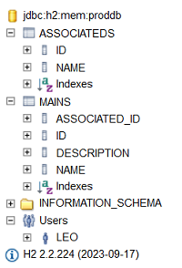
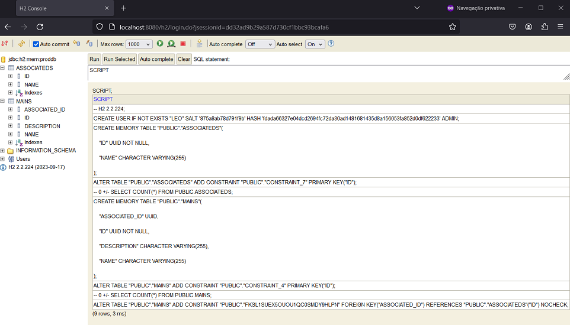
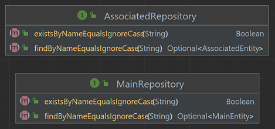

# TemplateCode - Java - Spring - Rest API
Autor: Leonardo Simões

Modelo de código para uma API Rest na linguagem Java com Spring Framework e Gradle.
A API possui dois recursos: MainResource e AssociatedResource.


## Etapas do desenvolvimento
As etapas de desenvolvimento do projeto foram:

1. Criar projeto (no IntelliJ) com:
- Linguagem Java (17);
- Spring Framework (6.2.3);
- Dependências: Web, DevTools, Lombok, JPA, H2 e Validation.



2. Alterar início da tela de Run com texto (ou imagem) personalizado:
- formatar o texto desejado usando `https://springhow.com/spring-boot-banner-generator/` e baixar `banner.txt`;



- colocar o arquivo `banner.txt` em `src/main/resources` (ou outro caminho);
- (opcional) adicionar `${spring.application.name}` e `Spring Boot ${spring-boot.formatted-version}` em `banner.txt`;
- (opcional) configurar o caminho do arquivo `banner.txt` em `application.properties`:
  * `spring.banner.location=classpath:/banner.txt`. 

3. Configurar o banco de dados H2: 
- Em `build.gradle` configurar de acordo com o tipo de uso desejado:
  * `implementation 'com.h2database:h2'`;
  * `runtimeOnly 'com.h2database:h2'`;
  * `testImplementation 'com.h2database:h2'`;
- Em `application.properties`:

```properties
# ======================================================
#               APPLICATION
# ======================================================
spring.application.name=TemplateCode-Java-Spring-RestAPI
# spring.banner.location=classpath:/banner.txt
# ======================================================
#               DATASOURCE - H2 DATABASE
# ======================================================
spring.datasource.url=jdbc:h2:mem:proddb
spring.datasource.driver-class-name=org.h2.Driver
spring.datasource.username=leo
spring.datasource.password=senha
spring.h2.console.enabled=true
spring.h2.console.path=/h2
```



- testar acesso ao console do H2 em `http://localhost:8080/h2/`:



Obs.: 
- Por padrão, o usename seria "sa" e a senha "", e o console do h2 estaria desativado.

4. Criar classe AssociatedEntity:
- no pacote `entities`;
- com atributos UUID id, String name;
- correspondente a tabela de nome `ASSOCIATEDS`.

5. Criar classe MainEntity:
- no pacote `entities`;
- com atributos UUID id, String name, String description e AssociatedEntity associated;
- correspondente a tabela de nome `MAINS`.



Obs.: Ao criar classes que representam entidades do banco de dados:
- anotá-las com `@Entity`, `@Table(name="...")` para mapear entidade; 
- anotá-las com `@Data`, `@NoArgsConstructor`, `@AllArgsConstructor` para usar o Lombok;
- adicionar atributo `UUID id` anotado com `@Id` e `@GeneratedValue(strategy = GenerationType.UUID)`;
- configurar relacionamentos com `@ManyToOne`, `@OneToMany` ou `@OneToOne` em atributos que são objetos;
- configurar as outras colunas com `@Column` e talvez algum validador como `@NotBlank` ou `@NotNull`;
- logar no console do H2 e verificar se as tabelas foram criadas corretamente:



6. Criar tabelas a partir de script SQL (e não do Hibernate):
- executar a aplicação com `spring.jpa.hibernate.ddl-auto=create-drop` em `application.properties`;
- executar o comando `SCRIPT` ou (`SCRIPT TO 'D:/schema.sql'`) para obter código SQL de criação de tabelas;
- colocar o conteúdo do passo anterior em `src/main/resources/schema.sql`;
- executar a aplicação com `spring.jpa.hibernate.ddl-auto=none` e
  `spring.jpa.defer-datasource-initialization=true` em `application.properties`;

```properties
# spring.jpa.hibernate.ddl-auto=create-drop
spring.jpa.hibernate.ddl-auto=none
spring.jpa.defer-datasource-initialization=true
spring.sql.init.mode=always
```

- (opcional) configurar o caminho do arquivo `schema.sql` em `application.properties`:
  * `spring.sql.init.schema-locations=classpath:/schema.sql`.



7. Criar interfaces `AssociatedRepository` e `MainRepository`:
- no pacote `repositories`;
- anotadas com `@Repository`;
- extends `JPARepository`;
- possuem declaração dos métodos `Boolean existsByNameEqualsIgnoreCase(String name)` e 
  `Optional<MainEntity> findByNameEqualsIgnoreCase(String name);`.




## Referências
Spring - Guides - Tutorials - Building REST services with Spring:
https://spring.io/guides/tutorials/rest

Baeldung - Rest with Spring Series:
https://www.baeldung.com/rest-with-spring-series

Baeldung - Spring Boot With H2 Database:
https://www.baeldung.com/spring-boot-h2-database

Baeldung - Quick Guide on Loading Initial Data with Spring Boot:
https://www.baeldung.com/spring-boot-data-sql-and-schema-sql