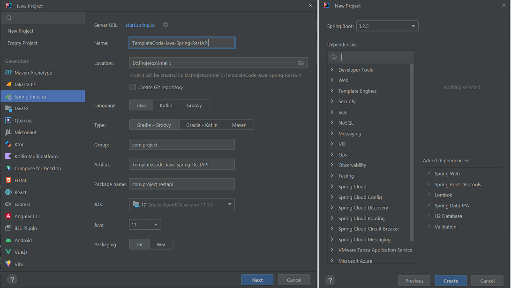

# TemplateCode - Java - Spring - Rest API
Author: Leonardo Simões

Template Code for a Rest API in the Java language with Spring Framework and Gradle.
The API has two resources: MainResource and AssociatedResource.

## Development steps
The project development steps were:

1. Create project (in IntelliJ) with:
- Java language (17);
- Spring Framework (6.2.3);
- Dependencies: Web, DevTools, Lombok, JPA, H2 and Validation.

2. Change the start of the Run screen with custom text (or image):
- format the desired text using `https://springhow.com/spring-boot-banner-generator/` and download `banner.txt`;

- place the `banner.txt` file in `src/main/resources` (or another path);
- (optional) add `${spring.application.name}` and `Spring Boot ${spring-boot.formatted-version}` in `banner.txt`;
- (optional) configure the `banner.txt` file path in `application.properties`:
    * `spring.banner.location=classpath:/banner.txt`.

## References
Spring - Guides - Tutorials - Building REST services with Spring:
https://spring.io/guides/tutorials/rest

Baeldung - Rest with Spring Series:
https://www.baeldung.com/rest-with-spring-series