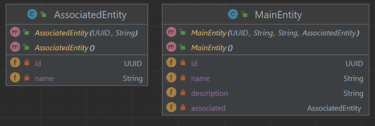
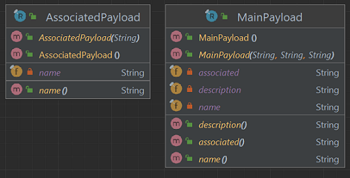
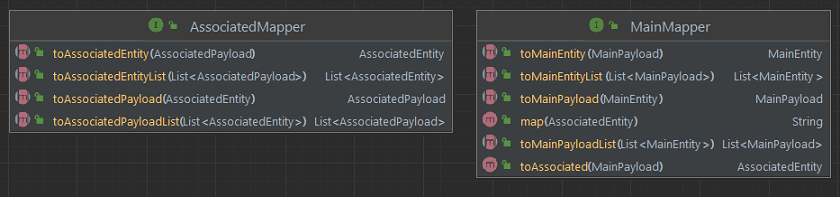

# TemplateCode - Java - Spring - Rest API
Author: Leonardo Simões

Template Code for a Rest API in the Java language with Spring Framework and Gradle.
The API has two resources: MainResource and AssociatedResource.


## Development steps
The project development steps were:

1. Create project (in IntelliJ) with:
- Java language (17);
- Spring Framework (6.2.3);
- Dependencies: Web, DevTools, Lombok, JPA, H2 and Validation.


2. Change the start of the Run screen with custom text (or image):
- format the desired text using `https://springhow.com/spring-boot-banner-generator/` and download `banner.txt`;


- place the `banner.txt` file in `src/main/resources` (or another path);
- (optional) add `${spring.application.name}` and `Spring Boot ${spring-boot.formatted-version}` in `banner.txt`;
- (optional) configure the `banner.txt` file path in `application.properties`:
    * `spring.banner.location=classpath:/banner.txt`.

3. Configure the H2 database:
- In `build.gradle` configure according to the desired type of use:
* `implementation 'com.h2database:h2'`;
* `runtimeOnly 'com.h2database:h2'`;
* `testImplementation 'com.h2database:h2'`;
- In `application.properties`:

```properties
# ======================================================
#               APPLICATION
# ======================================================
spring.application.name=TemplateCode-Java-Spring-RestAPI
# spring.banner.location=classpath:/banner.txt
# ======================================================
#               DATASOURCE - H2 DATABASE
# ======================================================
spring.datasource.url=jdbc:h2:mem:proddb
spring.datasource.driver-class-name=org.h2.Driver
spring.datasource.username=leo
spring.datasource.password=senha
spring.h2.console.enabled=true
spring.h2.console.path=/h2
```


- test access to the H2 console at `http://localhost:8080/h2/`:


Note:
- By default, the usename would be "sa" and the password "", and the h2 console would be disabled.

4. Create AssociatedEntity class:
- in the `entities` package;
- with attributes UUID id, String name;
- corresponding to the table named `ASSOCIATEDS`.

5. Create MainEntity class:
- in the `entities` package;
- with UUID id, String name, String description and AssociatedEntity associated attributes;
- corresponding to the table named `MAINS`.



Note: When creating classes that represent database entities:
- annotate them with `@Entity`, `@Table(name="...")` to map entity;
- annotate them with `@Data`, `@NoArgsConstructor`, `@AllArgsConstructor` to use Lombok;
- add attribute `UUID id` annotated with `@Id` and `@GeneratedValue(strategy = GenerationType.UUID)`;
- configure relationships with `@ManyToOne`, `@OneToMany` or `@OneToOne` in attributes that are objects;
- configure the other columns with `@Column` and perhaps some validator like `@NotBlank` or `@NotNull`;
- log into the H2 console and check if the tables were created correctly:


6. Create tables from SQL script (not from Hibernate):
- run the application with `spring.jpa.hibernate.ddl-auto=create-drop` in `application.properties`;
- execute the command `SCRIPT` or (`SCRIPT TO 'D:/schema.sql'`) to obtain SQL code for creating tables;
- place the content of the previous step in `src/main/resources/schema.sql`;
- run the application with `spring.jpa.hibernate.ddl-auto=none` and
  `spring.jpa.defer-datasource-initialization=true` in `application.properties`;

```properties
# spring.jpa.hibernate.ddl-auto=create-drop
spring.jpa.hibernate.ddl-auto=none
spring.jpa.defer-datasource-initialization=true
spring.sql.init.mode=always
```

- (optional) configure the `schema.sql` file path in `application.properties`:
  * `spring.sql.init.schema-locations=classpath:/schema.sql`.


7. Create `AssociatedRepository` and `MainRepository` interfaces:
- in the `repositories` package;
- annotated with `@Repository`;
- extends `JPARepository`;
- have declaration of the methods `Boolean existsByNameEqualsIgnoreCase(String name)` and
  `Optional<MainEntity> findByNameEqualsIgnoreCase(String name);`.


8. Create `AssociatedPayload` and `MainPayload` records:
- in the `records` package;
- with a constructor without arguments;



9. Create mappers between records ("payloads") and classes ("entities"):
- add addons in `build.gradle`:

```groovy
// compileOnly 'org.projectlombok:lombok'
implementation 'org.projectlombok:lombok'
implementation 'org.mapstruct:mapstruct:1.5.5.Final'
annotationProcessor 'org.mapstruct:mapstruct-processor:1.5.5.Final'
testAnnotationProcessor 'org.mapstruct:mapstruct-processor:1.5.5.Final'
implementation 'org.projectlombok:lombok-mapstruct-binding:0.2.0'
```

- create the `AssociatedMapper` and `MainMapper` interfaces:
  * annotated with `@Mapper`;
  * with `INSTANCE` attribute;
  * with 4 methods for conversions between entity and payload, and between list of entities and list of payloads;
  * `MainMapper` has two helper methods:
    * `default AssociatedEntity toAssociated(MainPayload payload)`;
    * `default String map(AssociatedEntity associatedEntity)`;




## References
Spring - Guides - Tutorials - Building REST services with Spring:
https://spring.io/guides/tutorials/rest

Baeldung - Rest with Spring Series:
https://www.baeldung.com/rest-with-spring-series

Baeldung - Spring Boot With H2 Database:
https://www.baeldung.com/spring-boot-h2-database

Baeldung - Quick Guide on Loading Initial Data with Spring Boot:
https://www.baeldung.com/spring-boot-data-sql-and-schema-sql

DZone - That’s How You Can Use MapStruct With Lombok in Your Spring Boot Application:
https://dzone.com/articles/thats-why-you-need-to-use-mapstruct-in-your-spring